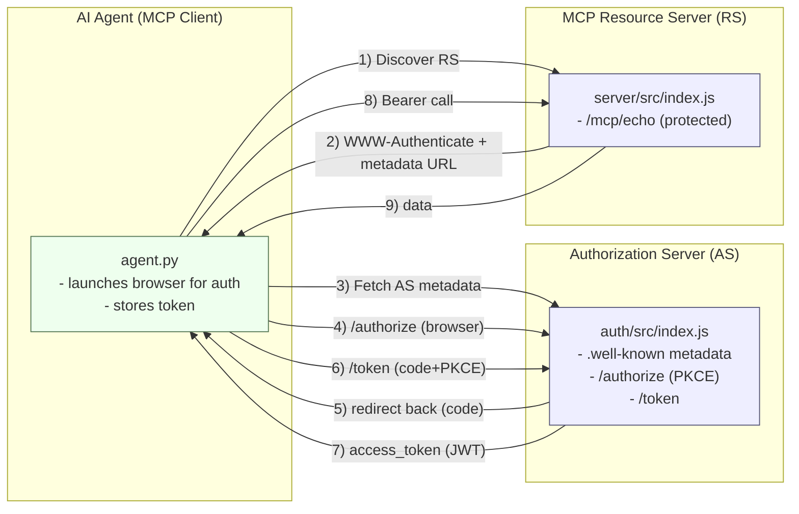
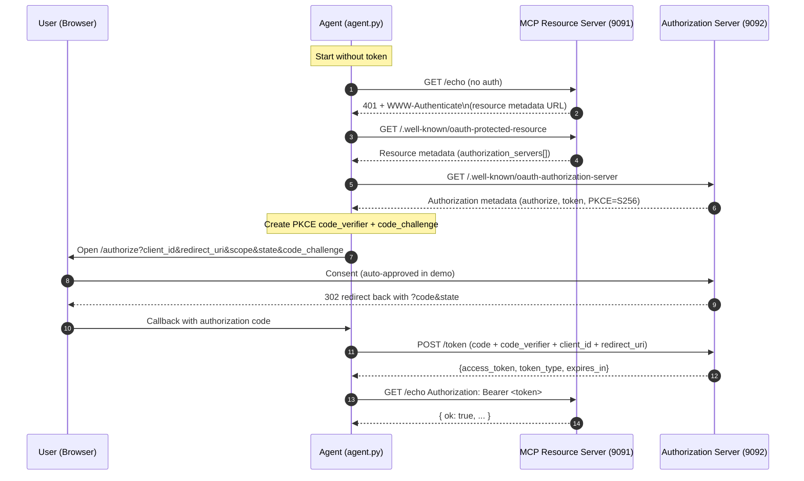
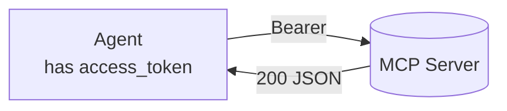
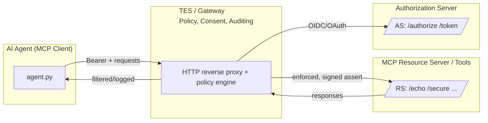
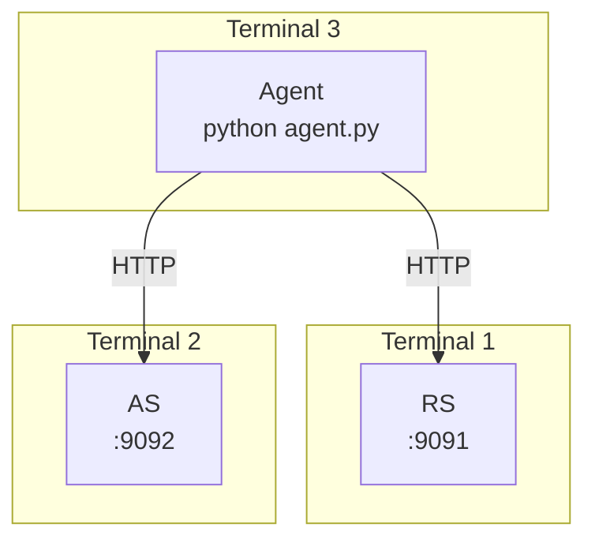
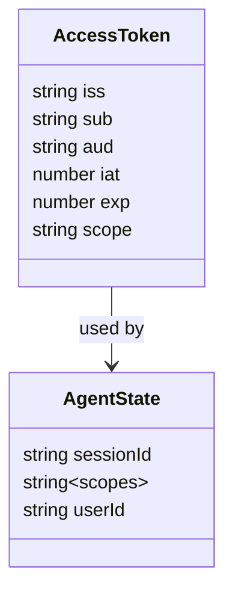

# MCP OAuth Demo – Architecture Diagrams

This document provides visual, high-level and detailed views of the current **MCP OAuth demo** you’re running locally.

It covers:
- Components and boundaries
- End‑to‑end Authorization Code + PKCE flow
- Normal tool call path after auth
- Where a **Gateway/TES** would slot in (future step)

---

## 1) High‑Level Component View

**Legend**
- **AG** = MCP client (your AI agent)  
- **AS** = Authorization Server (auth service)  
- **RS** = Resource Server (MCP server / tools)

---

## 2) Authorization Code + PKCE Sequence

---

## 3) Normal Tool Call Path (After Auth)

Typical RS behavior:
1. Verify JWT signature (HS256 in demo)
2. Check claims (`aud`, `scope`, `exp`)
3. Execute tool (e.g., `/echo`) and return result

---

## 4) Where the Gateway (TES) Will Sit (Future Step)

When added, the Gateway/TES will:
- Intercept the agent’s calls
- Enforce **fine‑grained policy** per request
- **Hide** raw OAuth tokens from the agent/tools (credential firewall)
- Optionally swap Bearer tokens for **internal assertion JWTs**
- Centralize audit logs

---

## 5) Ports & Processes (Local)

- **9091** – MCP Resource Server  
- **9092** – Authorization Server  
- Agent runs in its own terminal, launches the browser for the `/authorize` step.

---

## 6) Minimal Data Model (JWT)

In the demo:
- `alg: HS256`, `aud: "mcp-demo"`, `scope: "echo:read"`
- RS validates these claims before serving tools

---

## 7) Quick Reference

- **AS** (9092): `/.well-known/oauth-authorization-server`, `/authorize`, `/token`
- **RS** (9091): `/.well-known/oauth-protected-resource`, `/echo`, `/secure`
- **Agent**: runs Authorization Code + PKCE, stores token, calls RS with Bearer
- **Next step**: Insert Gateway/TES between Agent and RS/AS for enterprise authN/Z
